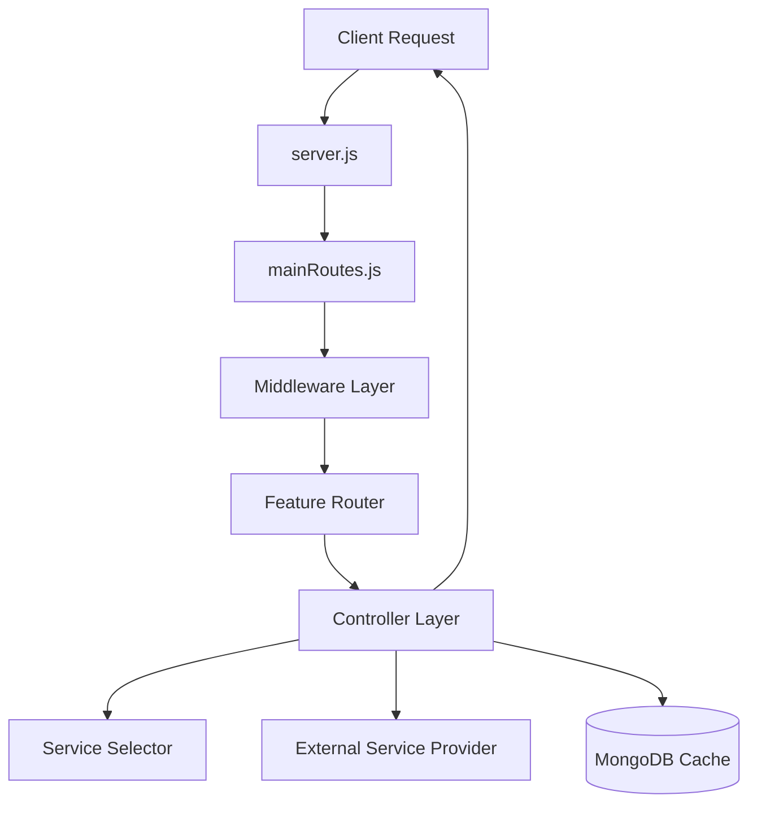

# Backend Flow Documentation: Flow Pipe (fl_backend)

This document outlines the architectural flow of the `fl_backend` module, from request initiation to external service integration and response delivery.

## 1. High-Level Architecture

The backend follows a modular architecture where each feature (PAN, Aadhaar, GST, etc.) is encapsulated within the `api/` directory. It uses Express.js for routing and MongoDB (Mongoose) for persistence and caching.

---

## 2. Request Entry Point (`server.js`)

All requests enter through `server.js`.
- **Security Middleware**: `helmet` and `cors` are applied.
- **Payload Parsing**: `body-parser` handles JSON and URL-encoded data (limit: 50MB).
- **Routing**: 
    - `/kyc/api/v1/ApiModuels`: Public/Open routes (`keysApiroutes`).
    - `/kyc/api/v1`: Primary business routes (`mainRoutes`).
    - `/kyc/api/v1/inhouse`: In-house routes that bypass security/decryption middleware.

---

## 3. Middleware Layer (`routes/mainRoutes.js`)

Most routes are protected by a stack of middleware:
1. **`clientValidation`**: Authenticates the client and validates their credentials.
2. **`decryptMiddleware`**: Decrypts the request payload if it's coming from an external source.
3. **`encryptMiddleware`**: Ensures the response will be encrypted before being sent back.

> [!NOTE]
> Routes mounted under `/inhouse` bypass these middlewares using the `bypassIfInHouse` helper.

---

## 4. Feature Flow (e.g., PAN Verification)

When a request reaches a controller (e.g., `panServices.controller.js`), it follows a standardized lifecycle:

### Phase 1: Preparation & Validation
- **Input Validation**: Formats (like PAN or Aadhaar numbers) are validated early using `handleValidation`.
- **Transaction Tracking**: A unique transaction ID is generated via `genrateUniqueServiceId`.
- **Identification**: Sensitive identifiers are hashed (`hashIdentifiers`) for rate-limiting and tracking without storing raw PII.

### Phase 2: Orchestration
- **Rate Limiting**: `checkingRateLimit` verifies if the client has remaining quota.
- **Monetization**: `deductCredits` or `chargesToBeDebited` is called to bill the client for the request.
- **Analytics**: `AnalyticsDataUpdate` increments usage counters for dashboard metrics.

### Phase 3: Data Retrieval (Cache-First)
- **Encryption**: Data is encrypted using `encryptData` before querying the database.
- **Cache Check**: The system searches for a pre-existing verified record in the database.
    - **Found**: Returns the cached result immediately (after updating the response log).
    - **Not Found**: Proceeds to external verification.

### Phase 4: External Service Integration
- **Service Selection**: `selectService` dynamically chooses an active service provider based on current configurations.
- **Execution**: The specific service wrapper (e.g., `PanActiveServiceResponse`) makes the outbound call to the provider.
- **Persistence**: Successful responses are encrypted and stored in MongoDB to serve as cache for future identical requests.

---

## 5. Directory Structure Overview

- `api/`: Feature-specific modules (Controllers, Models, Routes).
- `middleware/`: Custom Express middleware.
- `routes/`: Central routing configuration.
- `services/`: Core logic for credits, external API clients, etc.
- `utils/`: Reusable utilities (Encryption, ID generation, Logging, Analytics).
- `keys/`: Storage for cryptographic keys.

---

## 6. Verification & Persistence
- **Logging**: Detailed logs are captured via `kycLogger` for auditing and debugging.
- **Persistence**: All verification results and transaction logs are stored in MongoDB.
- **Performance**: Redis is used for high-frequency operations like rate limiting.
